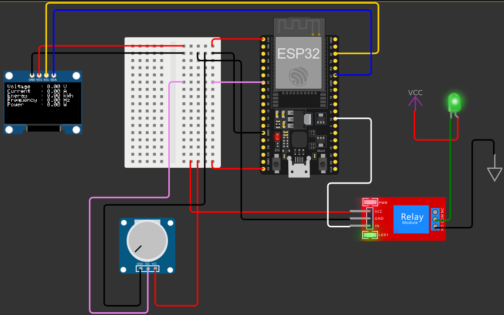

<h1>Smart Industry</h1>

Sistem monitoring dan kontrol daya listrik berbasis IoT menggunakan microcontroller ESP32 dan module PZEM-004T

## Components
### Komponen
1. Microcontroller ESP32 DevkitC V4
2. PZEM-004T (tidak ada di Wokwi) diganti dengan Potentiometer 
3. Relay 5V
4. OLED LCD i2C
5. Breadboard
6. Lampu LED
### Deskripsi
- **Pin VCC** pada module (komponen) `potentiometer` dan `relay` dihubungkan dengan **pin 5V** pada `ESP32`
- **Pin VCC** pada module (komponen) `OLED LCD i2c` dihubungkan dengan **pin 3.3V** pada `ESP32`
- Untuk **pin GND** (Ground) dari setiap komponen dihubungkan pada satu baris (row) yang sama di `Breadboard`
#### Module Potentiometer
- **Pin SIG** (sinyal/signal) pada `potensiometer` dihubungkan dengan **pin GPIO 32** pada `ESP32`
#### Module Relay 5V
- **Pin IN** (signal input dari ESP32 ke Relay) pada `relay` dihubungkan dengan **pin GPIO 16** pada `ESP32`
- **Pin COM** (common) pada `relay` dihubungkan dengan **pin A** (anode positive) pada `LED`
- **Pin NO** (normally open) pada `relay` dihubungkan dengan GND 
- Relay menggunakan "High Trigger - Normally Open Mode", artinya ketika **Pin IN** berubah LOW maka lampu menjadi mati (off), sedangkan ketika **pin IN** berubah HIGH maka lampu menjadi hidup (on)
#### Module OLED LCD i2C
- **Pin SCL** (clock line: menyinkronkan transfer data) pada `OLED LCD i2c` dihubungkan dengan **pin GPIO 22** pada `ESP32`. Pada `ESP32`, **pin GPIO 22** adalah **pin SCL**
- **Pin SDA** (data line: jalur transfer data) pada `OLED LCD i2c` dihubungkan dengan **pin GPIO 21** pada `ESP32`.  Pada `ESP32`, **pin GPIO 21** adalah **pin SDA**
### Wiring Diagram

## Development
### Visual Studio Code
#### Prerequisites
1. [Wokwi for VS Code Extension](https://marketplace.visualstudio.com/items?itemName=wokwi.wokwi-vscode): IoT and Embedded System Simulator
2. [PlatformIO IDE for VS Code Extension](https://marketplace.visualstudio.com/items?itemName=platformio.platformio-ide): tool for embedded software development
3. [Git](https://git-scm.com/downloads): version control system (opsional)
#### Deskripsi
- Folder `src` berisi file `main.cpp` yang berisi kode program utama microcontroller
- File `diagram.json` berisi komponen yang digunakan untuk simulasi serta koneksi (wiring) antar komponen menggunakan Wokwi
- File `wokwi.toml` berisi konfigurasi untuk menjalankan simulasi menggunakan Wokwi for VS Code
- Untuk penjelasan lebih lanjut mengenai Wokwi for VS Code bisa lihat pada https://docs.wokwi.com/vscode/getting-started 
#### How To Run:
- Pastikan sudah menginstall ekstensi Wokwi dan PlatformIO IDE pada VS Code
- Lakukan `build` pada project dengan menekan `f1` > cari `PlatformIO: Build` > tekan enter untuk memulai proses build
- Buka file `diagram.json` lalu klik tombol hijau di pojok kiri atas untuk menjalankan simulasi. Jika diminta untuk memasukkan lisensi kunjungi https://wokwi.com/license
### Troubleshoot
#### Lisensi Wokwi for VS Code
Kunjungi https://wokwi.com/license untuk mendapatkan lisensi Wokwi. Login menggunakan akun email (bisa pakai gmail). Jika sudah login, tekan tombol `Get License Key`. Selanjutnya copy lisensi. Buka VS Code dan tekan `f1` untuk memunculkan Command Pallete. Kemudian pada kolom pencarian ketik `Wokwi: Manually Enter License Key` lalu paste lisensi yang sudah di copy.
#### Simulasi tidak terupdate meskipun isi `main.cpp` (kode program) diubah
Jika ketika kode program pada file `main.cpp` atau file lain yang digunakan untuk menjalankan program diubah, lalu simulasi dijalankan dan tidak menunjukkan perubahan. Maka, lakukan `build` ulang (_rebuild_) pada project menggunakan platformIO. Untuk informasi lebih lanjut lihat https://community.platformio.org/t/vsc-pio-why-it-does-not-update-upon-code-change-before-build/10210/7 

## Contributors 
- Muhammad Asral - [@asral168](https://github.com/asral168)
- Hadi Setiawan - [@Hdi28](https://github.com/Hdi28)
- Salman Amario Simpati - [@salmanamariosimpati](https://github.com/salmanamariosimpati)
- Ahmad Amin Badani - [@AminBadani](https://github.com/AminBadani)
